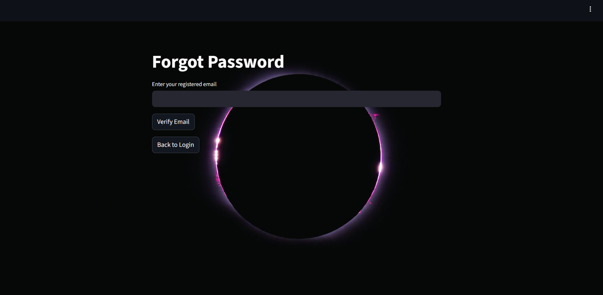

# 🧭 PolicyNav – Public Policy Navigation Using AI

## Milestone 1 – User Authentication System

---

## 📌 Description

In this milestone, we implemented a secure and robust user authentication system for **PolicyNav** using **Streamlit**, **JWT (JSON Web Tokens)**, and **SQLite**.

The system provides complete user management functionality including **Signup**, **Login**, **Forgot Password**, and a **JWT-protected Dashboard**, ensuring proper security practices and modern authentication workflows.

Passwords and security answers are securely hashed using **bcrypt**, and protected routes are validated via **JWT token verification**.

---

## ✅ Features Implemented

**User Signup with Validation**

- Mandatory input checks
- Email format validation
- Strong password enforcement
- Duplicate username/email prevention

**Secure Login System**

- Credential verification
- JWT token generation on success
- Proper error handling

**Forgot Password Flow**

- Email verification
- Security question validation
- Strong password reset rules

**JWT-Based Authentication**

- Token generation
- Protected dashboard access
- Session validation

**Security Best Practices**

- bcrypt password hashing
- No plaintext password storage
- Input validation & sanitization

**SQLite Database Integration**

- User data persistence
- Unique constraints for safety

**Ngrok Integration**

- Public access for Streamlit app
- Useful for Colab & demos

Public URL: https://731d-34-11-85-163.ngrok-free.app/

## ▶️ How to Run the Application

### 1️⃣ Install Dependencies

```bash
!pip install streamlit bcrypt PyJWT pyngrok
```

### 🔑 Login Page


### 🔐 Signup Page


### 🧭 Dashboard


### 🔁 Forgot Password Page


