# 🏛️ Infosys_Springboard_PolicyNav_Public-\_Policy_Navigation_Using_AI

> **Infosys Springboard Internship | Final Project**  
> An end-to-end intelligent policy analysis system featuring secure authentication, NLP-powered Q&A, multi-language support, knowledge graphs, and rich admin/user dashboards — deployed via Streamlit + Docker.

---

## 📋 Table of Contents

- [Project Overview](#-project-overview)
- [Architecture](#-architecture)
- [Tech Stack](#-tech-stack)
- [Feature Summary](#-feature-summary)
- [Milestone Breakdown](#-milestone-breakdown)
  - [Milestone 1 — Secure Authentication](#milestone-1--secure-authentication)
  - [Milestone 2 — Readability & OTP](#milestone-2--readability--otp-integration)
  - [Milestone 3 — NLP Engine & Knowledge Graph](#milestone-3--nlp-engine--knowledge-graph)
  - [Milestone 4 — Dashboards & Profile Personalization](#milestone-4--dashboards--profile-personalization)
  - [Docker Deployment](#docker-deployment)
- [Project Structure](#-project-structure)
- [Setup & Installation](#-setup--installation)
- [Environment Variables / Colab Secrets](#-environment-variables--colab-secrets)
- [Running the Application](#-running-the-application)
- [Database Schema](#-database-schema)

---

## 🌐 Project Overview

**PolicyNav** is an AI-powered web application that helps users navigate, understand, and query complex policy documents. Users can upload PDF policies, ask questions in multiple languages, get readability scores, explore an interactive knowledge graph of extracted entities, and receive summarizations — all within a secure, role-based platform.

The project was built incrementally over **4 milestones** during the Infosys Springboard Internship program, evolving from a basic authentication module to a fully-featured AI application, then containerized with Docker.

---

## 🏗️ Architecture

```
┌─────────────────────────────────────────────────────────────┐
│                      Streamlit Frontend                      │
│         (User Portal  |  Admin Dashboard  |  Profile)        │
└──────────────────────────────┬──────────────────────────────┘
                               │
┌──────────────────────────────▼──────────────────────────────┐
│                        app.py  (Backend)                     │
│  ┌──────────┐  ┌──────────┐  ┌────────────┐  ┌──────────┐  │
│  │  auth.py │  │readabil- │  │ nlp_engine │  │knowledge │  │
│  │  JWT/OTP │  │  ity.py  │  │    .py     │  │_graph.py │  │
│  └──────────┘  └──────────┘  └────────────┘  └──────────┘  │
│  ┌──────────┐  ┌──────────┐  ┌────────────┐                 │
│  │  db.py   │  │vector_   │  │ config.py  │                 │
│  │ SQLite3  │  │store.py  │  │            │                 │
│  └──────────┘  └──────────┘  └────────────┘                 │
└─────────────────────────────────────────────────────────────┘
                               │
          ┌────────────────────┼────────────────────┐
          │                    │                    │
   ┌──────▼──────┐   ┌─────────▼──────┐   ┌────────▼───────┐
   │  SQLite DB  │   │ FAISS Vector   │   │  Google Drive  │
   │  (Users,    │   │    Index       │   │  (PDFs, Graphs,│
   │  History,   │   │ (Embeddings)   │   │   Avatars)     │
   │  Feedback)  │   └────────────────┘   └────────────────┘
   └─────────────┘
```

---

## 🧰 Tech Stack

| Layer | Technology |
|---|---|
| **Frontend** | Streamlit, streamlit-option-menu, streamlit-autorefresh |
| **Authentication** | JWT (PyJWT), bcrypt, OTP via Gmail SMTP |
| **NLP / AI** | Qwen/Qwen2.5-1.5B-Instruct (Q&A), facebook/nllb-200-distilled-600M (Translation) |
| **Embeddings** | sentence-transformers, FAISS (faiss-cpu) |
| **Knowledge Graph** | spaCy (en_core_web_sm), NetworkX, PyVis |
| **Readability** | textstat |
| **Document Parsing** | PyPDF2, BeautifulSoup4 |
| **Database** | SQLite3 |
| **Visualization** | Plotly, Matplotlib, WordCloud |
| **AI API** | Anthropic Claude API |
| **Deployment** | Google Colab + pyngrok, Docker |
| **Language** | Python 3.12 |

---

## ✨ Feature Summary

| Feature | Description |
|---|---|
| 🔐 JWT Authentication | Secure token-based login with configurable expiry |
| 📧 OTP Verification | Email-based one-time password for login & registration |
| 🔒 Account Lockout | Auto-lock after 3 failed attempts for 5 minutes |
| 🔑 Forgot Password | Secure reset flow with password history enforcement (last 3) |
| 📊 Readability Dashboard | 5 readability metrics (Flesch, SMOG, Coleman, etc.) per document |
| 🤖 Q&A Engine | Retrieval-Augmented Generation (RAG) over uploaded PDFs |
| 🌍 Multi-Language Support | Query and summarize in multiple languages via NLLB-200 |
| 🕸️ Knowledge Graph | Interactive entity & relationship visualization using PyVis |
| 👤 User Profile | Avatar upload, email/password update |
| 🛡️ Admin Dashboard | User management, analytics charts, WordCloud, data export |
| 🐳 Docker | Containerized deployment with image build & container run |

---

## 📍 Milestone Breakdown

---

### Milestone 1 — Secure Authentication

**Goal:** Build a robust, production-grade authentication system.

#### Features Implemented

- **User Registration & Login** with bcrypt password hashing
- **JWT-based session management** (1-hour token expiry)
- **OTP Authentication** — 6-digit code delivered via Gmail SMTP for identity verification
- **Account Lockout** — Accounts are locked for **5 minutes** after **3 consecutive failed login attempts**
- **Forgot Password Flow** — OTP-verified reset; system rejects the **last 3 previously used passwords**
- **Admin Login** — Separate admin credentials via environment secrets, grants access to the Admin Dashboard
- **Input Validation** — Email format checks, password strength enforcement

#### Key Files

| File | Purpose |
|---|---|
| `auth.py` | Core auth logic: hashing, JWT generation, OTP send/verify, lockout |
| `db.py` | SQLite schema and all DB helper functions |
| `config.py` | Centralised config: JWT secret, lock time, password history count |

#### Colab Secrets Required

```
JWT_SECRET_KEY      — Secret key for signing JWT tokens
EMAIL_ID            — Gmail address used to send OTPs
EMAIL_APP_PASSWORD  — 16-digit Gmail App Password (NOT your Gmail password)
ADMIN_EMAIL_ID      — Admin login email
ADMIN_PASSWORD      — Admin login password
NGROK_AUTHTOKEN     — For exposing Streamlit via ngrok tunnel
```

> **How to generate a Gmail App Password:**  
> Google Account → Security → Enable 2-Step Verification → App Passwords → Generate → Copy immediately.

---

### Milestone 2 — Readability & OTP Integration

**Goal:** Enhance the platform with document readability analytics and a polished UI.

#### Features Implemented

- **Readability Dashboard** powered by `textstat`:
  - Flesch Reading Ease
  - Flesch-Kincaid Grade Level
  - SMOG Index
  - Coleman-Liau Index
  - Gunning Fog Index
- **OTP fully integrated** into the registration and login flows
- **Improved UI/UX** — Streamlit option-menu navigation, themed layouts, better form flows
- **Document Upload** — PDF upload to Google Drive persisted storage

#### Key Files

| File | Purpose |
|---|---|
| `readability.py` | `ReadabilityAnalyzer` class wrapping all textstat metrics |

---

### Milestone 3 — NLP Engine & Knowledge Graph

**Goal:** Add intelligent document understanding: Q&A, translation, and graph-based entity exploration.

#### Features Implemented

- **Q&A Multi-Language Engine (RAG pipeline)**
  - Documents ingested into a **FAISS** vector index using `sentence-transformers`
  - User queries retrieve the top-k relevant chunks
  - **Qwen/Qwen2.5-1.5B-Instruct** generates answers grounded in retrieved context
  - Supports querying in multiple languages

- **Multi-Language Summarization**
  - `facebook/nllb-200-distilled-600M` handles translation across multiple languages
  - Users can select target language for summaries and Q&A responses

- **Knowledge Graph**
  - **spaCy** (`en_core_web_sm`) extracts named entities and relations from policy documents
  - **NetworkX** builds an undirected graph of entities and co-occurrence relationships
  - **PyVis** renders an interactive HTML visualization saved to Google Drive

#### Key Files

| File | Purpose |
|---|---|
| `vector_store.py` | PDF ingestion, FAISS index build/load, chunk retrieval |
| `nlp_engine.py` | Model loading (Qwen2.5, NLLB-200), Q&A generation, translation |
| `knowledge_graph.py` | Entity extraction, graph construction, PyVis HTML export |

#### Model Details

| Model | Task | Source |
|---|---|---|
| `Qwen/Qwen2.5-1.5B-Instruct` | Q&A / Text generation |  Hugging Face |
| `facebook/nllb-200-distilled-600M` | Translation |  Hugging Face |
| `all-MiniLM-L6-v2` | Sentence embeddings for retrieval | sentence-transformers |
| `en_core_web_sm` | NER / Entity extraction | spaCy |

---

### Milestone 4 — Dashboards & Profile Personalization

**Goal:** Build a fully-featured Admin Dashboard and enrich the User Profile experience.

#### Admin Dashboard Features

| Feature | Details |
|---|---|
| **User Control** | Promote users to Admin, lock/unlock accounts, delete users |
| **Activity Tracking** | Real-time active users, full system history log |
| **Model Usage Chart** | Plotly bar chart — which AI models are being invoked |
| **Language Usage Chart** | Plotly chart — language distribution across all sessions |
| **Feature Popularity** | Chart showing which features (Q&A, Summarize, Graph, etc.) are most used |
| **Feedback WordCloud** | Matplotlib WordCloud generated from all user feedback submissions |
| **Data Export** | Download feedback, history logs, and user list as CSV/JSON |

#### User Dashboard & Profile Features

| Feature | Details |
|---|---|
| **Avatar Upload** | Users can upload a profile picture (stored in Google Drive `/avatars`) |
| **Email Update** | OTP-verified email address change |
| **Password Change** | Enforces password history (last 3 passwords cannot be reused) |
| **Session History** | Users can view their own Q&A and summarization history |

---

### Docker Deployment

**Goal:** Containerize the application for portable, reproducible deployment.

#### What Was Done

- Created a `Dockerfile` defining the Python environment and dependencies
- Built a Docker image from the project directory
- Ran the Streamlit application inside a Docker container

#### Quick Docker Commands

```bash
# Build the image
docker build -t policynav .

# Run the container (maps container port 8501 to host port 8501)
docker run -p 8501:8501 policynav
```

#### Sample Dockerfile

```dockerfile
FROM python:3.12-slim

WORKDIR /app

COPY requirements.txt .
RUN pip install --no-cache-dir -r requirements.txt

COPY . .

EXPOSE 8501

CMD ["streamlit", "run", "app.py", "--server.port=8501", "--server.address=0.0.0.0"]
```

---

## 📁 Project Structure

```
PolicyNav/
│
├── Milestone1/
│   ├── policynav_m1.ipynb      # Auth system notebook
│   └── README.md
│
├── Milestone2/
│   ├── policynav_m2.ipynb      # Readability + OTP notebook
│   └── README.md
│
├── Milestone3/
│   ├── policynav_m3.ipynb      # NLP + Knowledge Graph notebook
│   └── README.md
│
├── Milestone4/
│   ├── policynav_project.ipynb # Full integrated notebook
│   └── README.md
│
├── Docker/
│   ├── Dockerfile
│   └── requirements.txt
│
└── README.md                   ← You are here
```

#### Generated Source Files (written by notebook cells)

```
app.py              — Main Streamlit application
auth.py             — Authentication: JWT, OTP, lockout, password history
db.py               — SQLite database schema and queries
config.py           — App-wide configuration constants
readability.py      — Readability metrics 
vector_store.py     — FAISS document ingestion and retrieval
nlp_engine.py       — Qwen2.5 Q&A + NLLB translation
knowledge_graph.py  — spaCy NER + NetworkX + PyVis graph
```

---

## ⚙️ Setup & Installation

### Prerequisites

- Python **3.10+**
- Google Colab (recommended) with GPU runtime (T4 or better)
- A Gmail account with **2-Step Verification** enabled
- An ngrok account (free tier is sufficient)
- Anthropic API key (for Claude API integration in Milestone 4)

### Install Dependencies

```bash
pip install streamlit pyjwt bcrypt python-dotenv pyngrok nltk \
            streamlit-option-menu plotly textstat PyPDF2 beautifulsoup4 \
            streamlit-autorefresh wordcloud matplotlib langdetect pandas \
            transformers torch sentence-transformers faiss-cpu accelerate \
            spacy networkx pyvis bitsandbytes anthropic

python -m spacy download en_core_web_sm
```

---

## 🔐 Environment Variables / Colab Secrets

Add these in **Google Colab → Secrets (key icon in sidebar)**:

| Secret Name | Description |
|---|---|
| `JWT_SECRET_KEY` | Random secret string for signing JWTs |
| `EMAIL_ID` | Your Gmail address for sending OTPs |
| `EMAIL_APP_PASSWORD` | 16-digit Gmail App Password |
| `ADMIN_EMAIL_ID` | Admin account email |
| `ADMIN_PASSWORD` | Admin account password |
| `NGROK_AUTHTOKEN` | Your ngrok authentication token |
| `ANTHROPIC_API_KEY` | Anthropic Claude API key |

> ⚠️ **Never use your regular Gmail password** for `EMAIL_APP_PASSWORD`. Generate a dedicated App Password from Google Account settings.

---

## 🚀 Running the Application

### On Google Colab

1. Open the notebook in Colab and select **T4 GPU** runtime.
2. Set all required secrets via the Secrets panel.
3. Run all cells in order:
   - **Cell 1** — Mount Google Drive & create directories
   - **Cells 2–9** — Write all source `.py` files
   - **Cell 10** — Load secrets into environment
   - **Cell 11** — Ingest PDFs into FAISS vector store
   - **Cell 13** — Start Streamlit via ngrok → copy the printed public URL

### On Local Machine / Docker

```bash
# Clone the repo
git clone <your-repo-url>
cd PolicyNav

# Set environment variables
export JWT_SECRET_KEY="your-secret"
export EMAIL_ID="your@gmail.com"
export EMAIL_APP_PASSWORD="xxxx xxxx xxxx xxxx"
export ADMIN_EMAIL_ID="admin@example.com"
export ADMIN_PASSWORD="adminpassword"
export ANTHROPIC_API_KEY="sk-ant-..."

# Run directly
streamlit run app.py

# OR via Docker
docker build -t policynav .
docker run -p 8501:8501 \
  -e JWT_SECRET_KEY=$JWT_SECRET_KEY \
  -e EMAIL_ID=$EMAIL_ID \
  -e EMAIL_APP_PASSWORD=$EMAIL_APP_PASSWORD \
  policynav
```

Open **http://localhost:8501** in your browser.

---

## 🗄️ Database Schema

The SQLite database (`policynav_users.db`) contains the following tables:

### `users`
| Column | Type | Description |
|---|---|---|
| `id` | INTEGER PK | Auto-increment user ID |
| `username` | TEXT | Display name |
| `email` | TEXT UNIQUE | Login email |
| `password_hash` | TEXT | bcrypt-hashed password |
| `is_admin` | INTEGER | 1 = Admin, 0 = Regular user |
| `is_locked` | INTEGER | 1 = Account locked |
| `lock_until` | TEXT | Lock expiry timestamp |
| `failed_attempts` | INTEGER | Consecutive failed login count |
| `avatar_path` | TEXT | Path to user avatar image |
| `created_at` | TEXT | Account creation timestamp |

### `password_history`
| Column | Type | Description |
|---|---|---|
| `id` | INTEGER PK | Auto-increment |
| `user_id` | INTEGER FK | References `users.id` |
| `password_hash` | TEXT | Previous password hash |
| `changed_at` | TEXT | Timestamp of change |

### `history`
| Column | Type | Description |
|---|---|---|
| `id` | INTEGER PK | Auto-increment |
| `user_id` | INTEGER FK | References `users.id` |
| `feature` | TEXT | Feature used (Q&A, Summary, etc.) |
| `model` | TEXT | AI model invoked |
| `language` | TEXT | Target language |
| `query` | TEXT | User's input |
| `response` | TEXT | System's response |
| `created_at` | TEXT | Timestamp |

### `feedback`
| Column | Type | Description |
|---|---|---|
| `id` | INTEGER PK | Auto-increment |
| `user_id` | INTEGER FK | References `users.id` |
| `rating` | INTEGER | Star rating (1–5) |
| `comment` | TEXT | User feedback text |
| `created_at` | TEXT | Timestamp |

---
### 🔑 Login Page

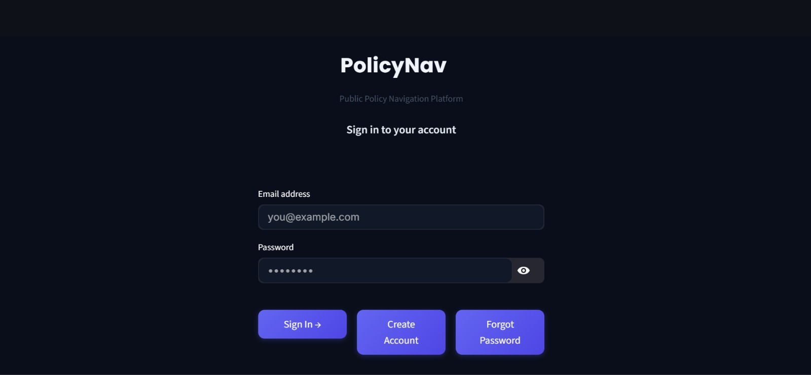

### 〰️ Dashboard

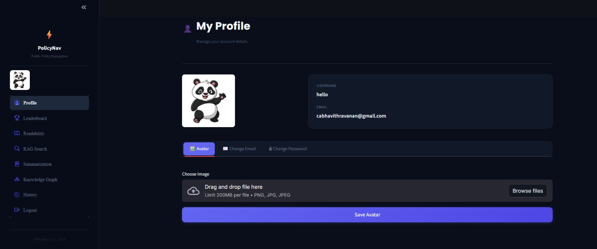

### 🔐 Admin

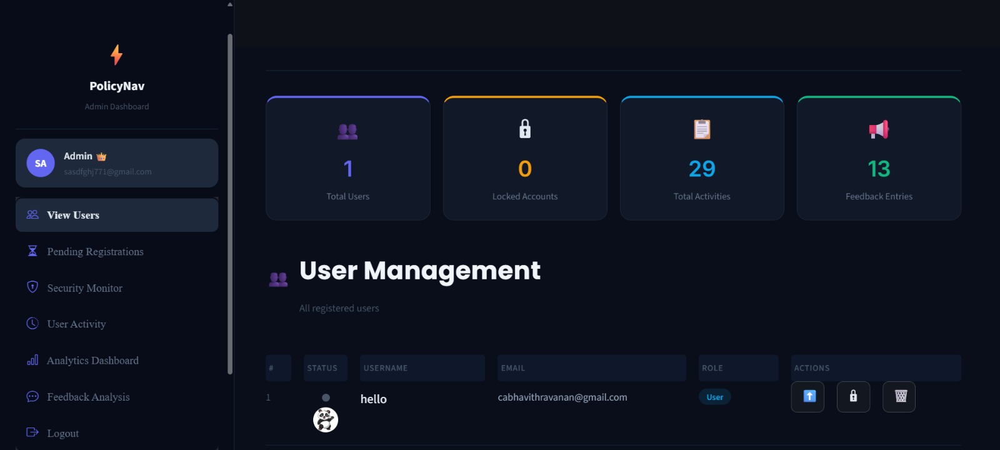

### 🧭 Pending Registrations

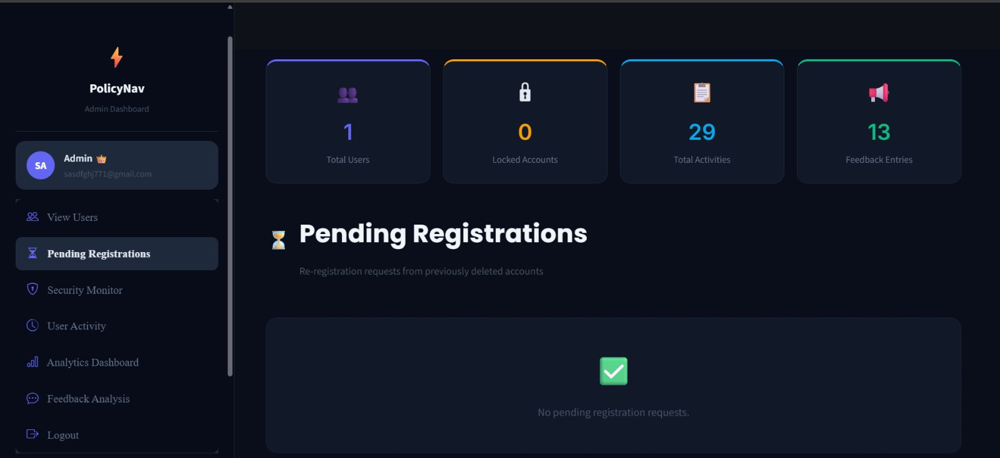

### 🔒 Admin Security Monitor

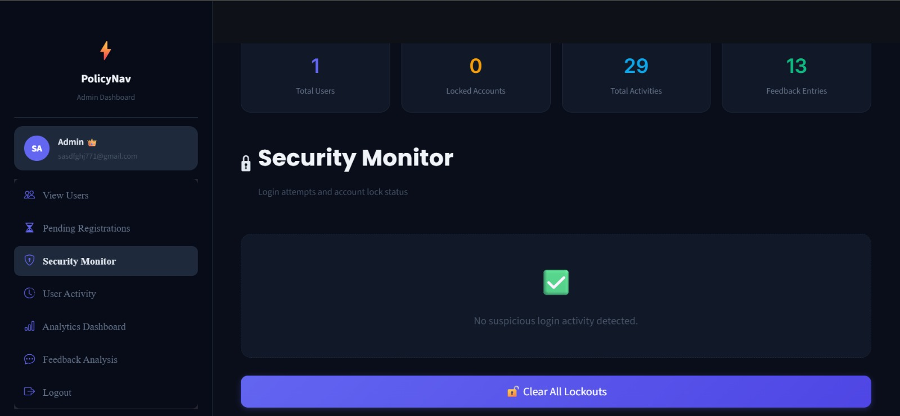

### 🔁 User Activity

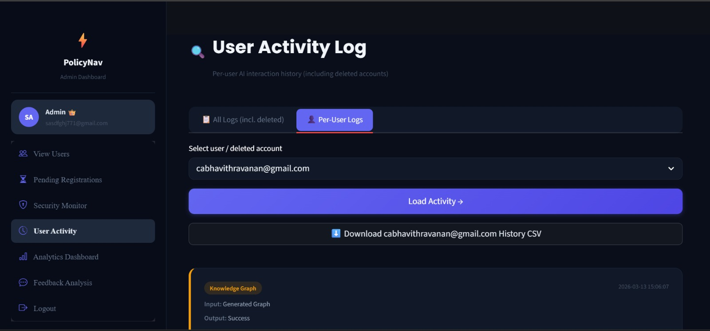

### 🔍 Analytics Dashboard

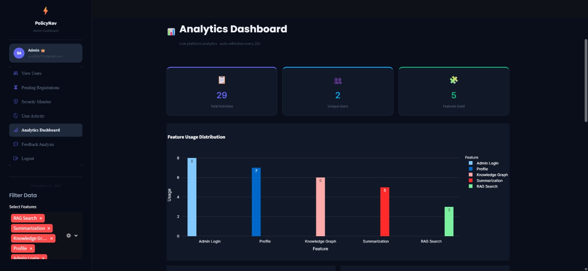
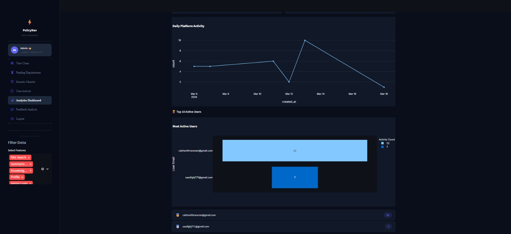

### 🔐 Feedback

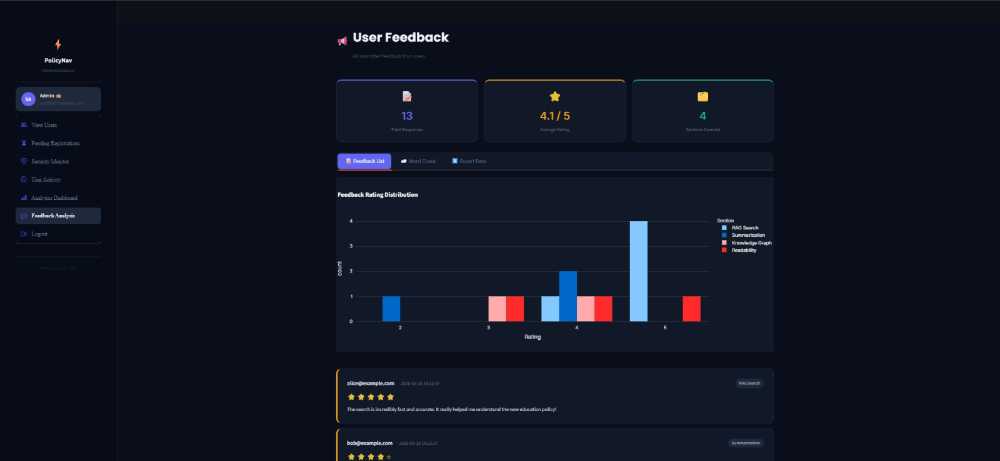
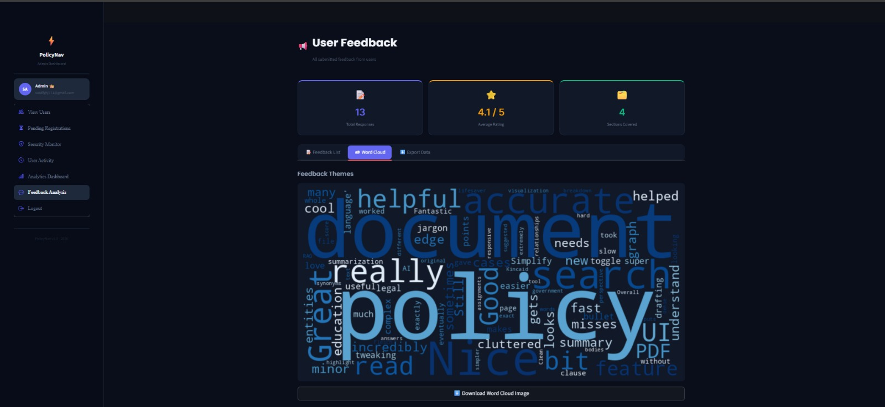
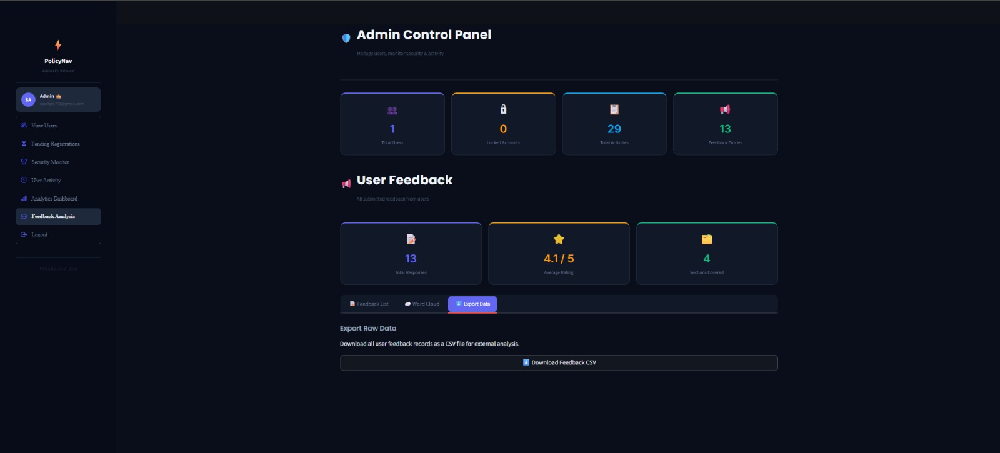

### 📖 Readability Analyzer

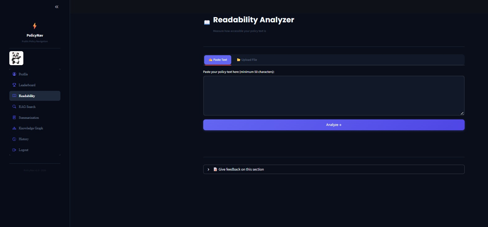

### 🧾 Summarization

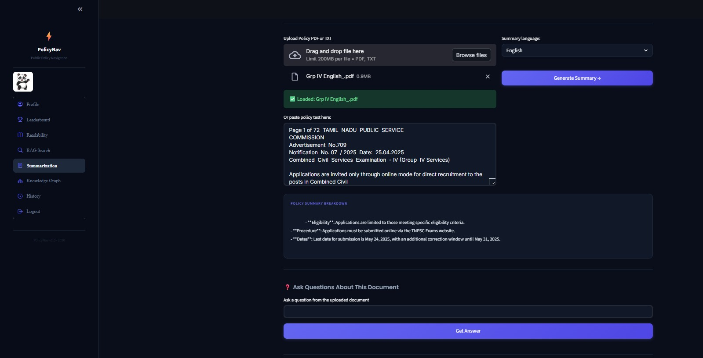

### 🎯 Gamification

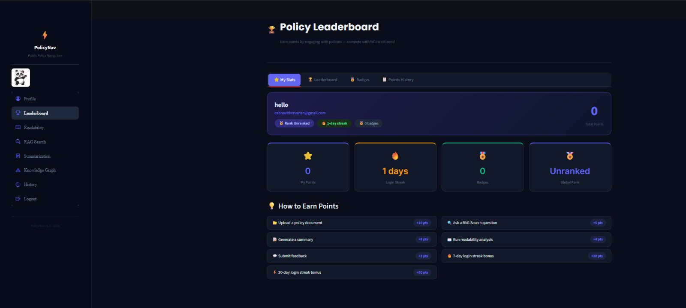

### 💹 Knowledge Graph

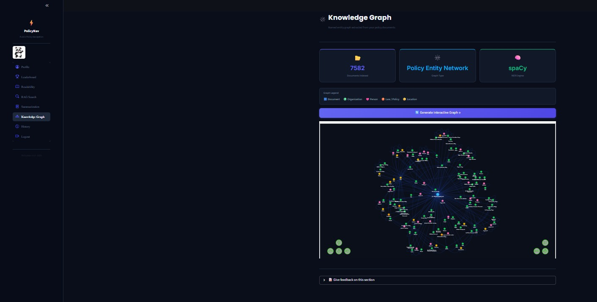
---

# Author

**Infosys Springboard Virtual Internship – Batch 13** <br>
Bhavithravanan C A - User control in admin dashboard and identity in user dashboard <br>
Gaurav Mehtha - Data Visualization: Plot interactive charts <br>
Junaid Bin Riyaz - User Dashboard: Security and Ui/Ux <br>
Prapti Nikam - User Engagement Gamification leaderboard unique feature and Activity Tracking <br>
Srinivasa Rajan M - Admin Dashboard, Feedback analysis, Added 20+ multi Lingual support, News & Updates from admin Dashboard for Users.
