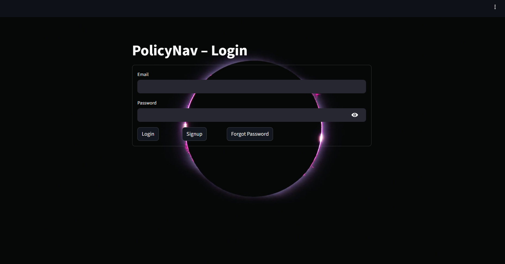
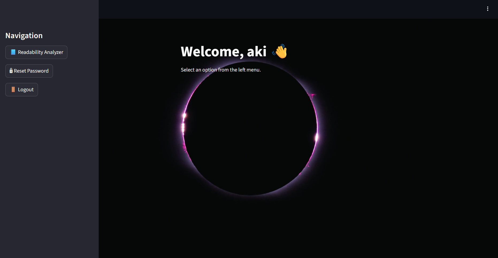
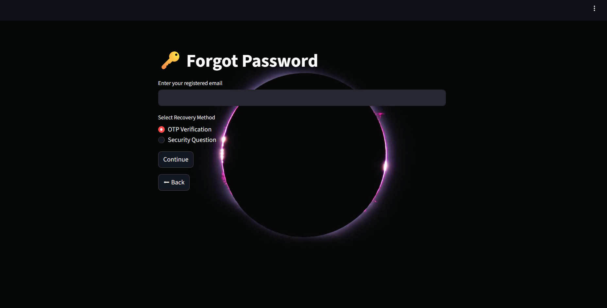

## Milestone 2 – Advanced Authentication & Readability Analyzer

---

## 📌 Description

In this milestone, we also implemented OTP-based verification, incorporated advanced security controls to the PolicyNav Authentication System, and included a Text Readability Analyzer module․

Milestone 2 is based on Milestone 1, with a focus on improved authentication workflows, account security, and text analysis․

The system now implements a more secure and realistic authentication model using **Streamlit**, **JWT (JSON Web Tokens)**, **SQLite**, **bcrypt**, and **Email OTP Verification**․

A **Readability Analyzer** feature was also added, which analyzes the text for standard statistics․

---

## ✅ Features Implemented

**OTP-Based Login Verification**

- Email OTP generation
- Secure OTP validation
- Two-step login protection
- Prevents unauthorized access even with correct credentials

**Advanced Authentication Controls**

- Account lock after failed attempts
- Login attempt tracking
- Password history enforcement
- Prevention of password reuse
- Session validation via JWT

**User Signup/Login with Validation**

- Mandatory input checks
- Email format validation
- Strong password (Alphanumeric)
- Duplicate username/email prevention

**Secure Login System**

- Credential verification
- JWT token generation on success

**Forgot Password Flow**

- Email verification
- Security question validation
- Strong password reset rules

**JWT-Based Authentication**

- Token generation
- Protected dashboard access
- Session validation

**Security Best Practices**

- bcrypt password hashing
- No plaintext password storage
- Input validation & sanitization

**Text Readability Analyzer**

The Readability Analyzer module allows users to evaluate textual difficulty using industry-standard metrics.
*Supported Inputs:*
- Manual text input
- TXT file upload
- PDF file upload
*Metrics Included:*
- Flesch Reading Ease
- Flesch-Kincaid Grade
- Gunning Fog Index
- SMOG Index
- Coleman-Liau Index
- Automated Readability Index
- Dale-Chall Score
- Text Standard

**SQLite Database Integration**

- User data persistence

**Ngrok Integration**

- Public access for Streamlit app
- Useful for Colab & demos

Ngrok website: ngrok.com

- Navigate to Authtoken and copy the token_id
- Paste the token_id ( ngrok.set_auth_token("PASTE_TOKEN") )

## ▶️ How to Run the Application

### 1. Install Dependencies

```bash
!pip install streamlit bcrypt PyJWT pyngrok
```

### 2. Streamlit

```bash
!streamlit run app.py &>/content/log.txt &
```

### 3. Use Ngrok to expose the app

```bash
from pyngrok import ngrok
ngrok.set_auth_token("TOKEN")
print(ngrok.connect(8501))
```

Open the public link after running Ngrok, example below:
Public URL: https://731d-34-11-85-163.ngrok-free.app/

### 🔑 Login Page



### 🔐 Signup Page


### 🧭 Dashboard



### 🔒 Reset


### 🔁 Forgot Password Page

# 

# Infosys_Springboard_PolicyNav_Public-\_Policy_Navigation_Using_AI

Gaurav Mehta | Flagship Module: PolicyNav – Public Policy Navigation Using AI

