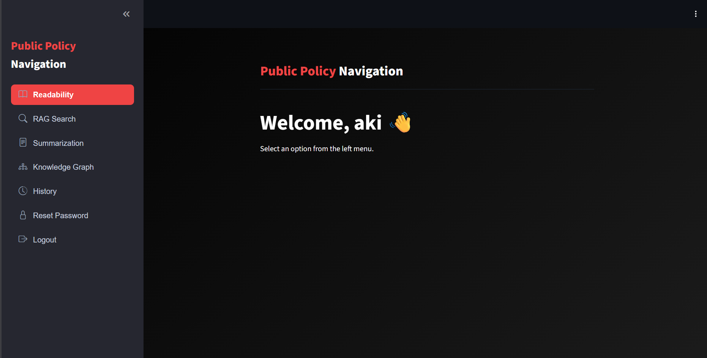
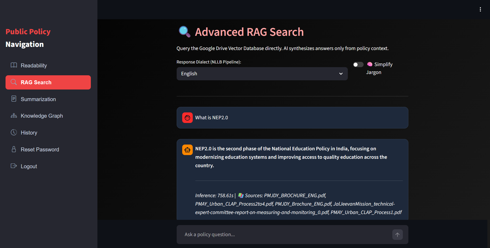
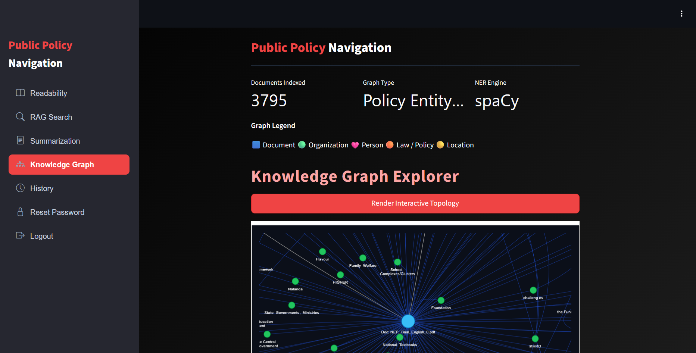
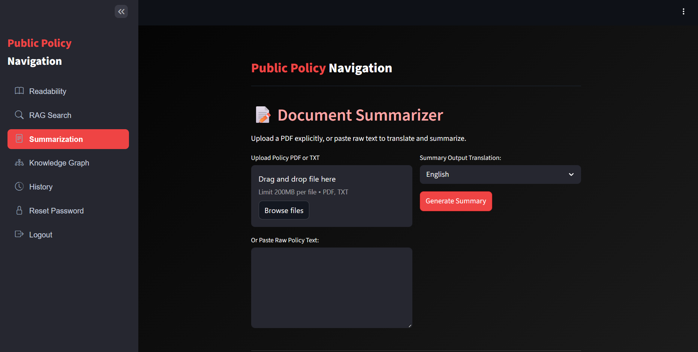
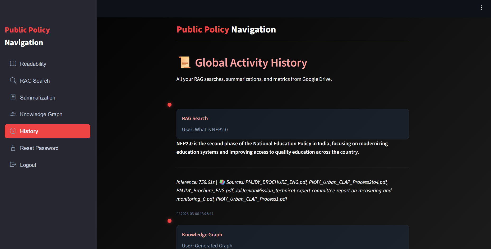
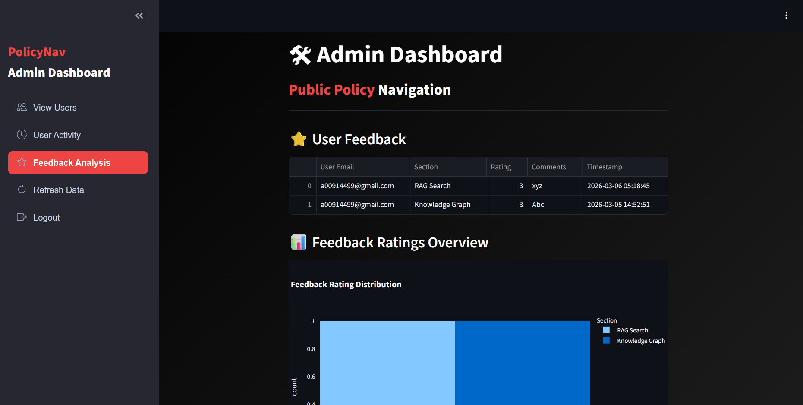
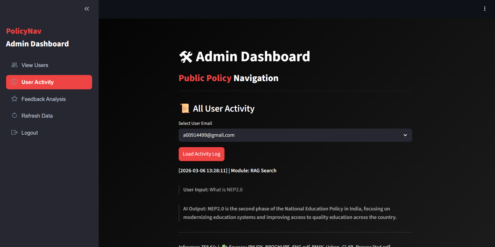

# PolicyNav – AI-Powered Public Policy Navigation

## Project Overview
**PolicyNav** is an AI-powered web application developed as part of the **Infosys Springboard Virtual Internship**.  
The system helps users **search, analyze, and understand public policy documents** using AI-based tools such as **RAG search, readability analysis, summarization, and knowledge graph visualization**.

The platform also includes a **secure authentication system with OTP verification and JWT-based sessions**, ensuring safe access to the system.

---

# Technologies Used

### Programming
- Python

### Frontend
- Streamlit

### Backend
- Python Application Logic

### Database
- SQLite

### Security
- JWT Authentication  
- OTP Email Verification  
- Password Reset System  

### AI / NLP
- RAG (Retrieval Augmented Generation)  
- Policy Summarization  
- Readability Analysis  

### Visualization
- Plotly Dashboards  
- Knowledge Graph Visualization  

### Deployment
- Google Colab  
- Ngrok  

---

# Features Implemented

## User Authentication
- Secure user signup and login
- Email verification using OTP
- Password reset using OTP authentication
- JWT token-based session management
- Secure password storage

---

## Readability Dashboard
Displays readability metrics for policy documents including:

- **Flesch Reading Ease** – Measures how easy the text is to read.
- **Flesch–Kincaid Grade Level** – Indicates the school grade level required to understand the text.
- **SMOG Index** – Estimates the years of education needed to understand the document.
- **Gunning Fog Index** – Measures complexity based on sentence length and difficult words.
- **Coleman–Liau Index** – Uses characters per word and sentence length to estimate readability.

These metrics are displayed using **interactive gauge charts**.

---

## RAG Policy Search
The **Retrieval Augmented Generation (RAG)** module allows users to:

- Ask questions related to policy documents
- Retrieve relevant document sections
- Generate AI-assisted answers

This helps users **quickly understand complex policy information**.

---

## Policy Summarization
The summarization module allows users to:

- Generate **concise summaries of long policy documents**
- Extract the **key insights and important points**

This improves readability and comprehension of lengthy government documents.

---

## Knowledge Graph
The system generates a **knowledge graph visualization** that shows:

- Relationships between policy topics
- Key entities present in documents
- Connections between policies

This helps users **understand policy relationships visually**.

---

## History Tracking
The application maintains a **history of user interactions**, including:

- Previous policy searches
- Generated summaries
- Dashboard analysis

This helps users revisit previously analyzed policies.

---

## Admin Dashboard
The **Admin Tab** allows administrators to:

- View registered users
- Monitor system usage
- Manage application data

This ensures **better control and monitoring of the platform**.

---

# Required Secret Keys

The application requires the following **secret keys to run securely**:
JWT_SECRET_KEY
NGROK_AUTHTOKEN
EMAIL_ID
EMAIL_APP_PASSWORD
ADMIN_EMAIL_ID
ADMIN_PASSWORD

These should be stored securely using **Google Colab Secrets**.

# How to Run the Application (Google Colab)

### Step 1 – Install Dependencies
Run the first cell in the notebook to install all required Python packages.

### Step 2 – Create the Streamlit Application
Execute the cell that writes the `app.py` file.

### Step 3 – Start the Streamlit Server
Run the final cell to start the Streamlit application.

### Step 4 – Expose Public URL using Ngrok
Ngrok will generate a **public URL** which can be opened in the browser to access the application.

⚠️ Before uploading the project to GitHub, remove the **ngrok authentication token**.

---

# Application Screenshots

## Dashboard

---

## RAG Search

---

## Knowledge Graph

---

## Policy Summarization

---

## History Tab

---

## Admin Dashboard

---

# Author

**Infosys Springboard Virtual Internship – Batch 13**
Velagada Devi Sri Prasad 
Gaurav Mehtha 
Bavithravanan CV
Pooja K
Arun Kumar Goshala

Project: **PolicyNav – AI-Powered Public Policy Navigation**
